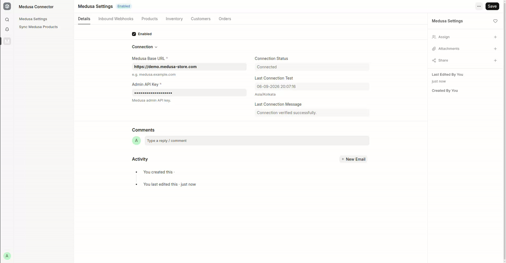

<div align="center">
    <a href="https://github.com/aerele/medusa-connector">
	
    </a>
    <h2>Medusa Connector for ERPNext</h2>
    <div align="center">
        <p>Connect Medusa and ERPNext.</p>
    </div>

[](https://github.com/aerele/medusa-connector/actions/workflows/ci.yml)
[](https://github.com/aerele/medusa-connector/actions/workflows/linters.yml)
[](license.txt)
</div>

<div align="center">
	<a href="docs/MEDUSA_WEBHOOK_SETUP.md">Webhook Setup Guide</a>
	-
	<a href="docs/MEDUSA_ORDER_LIFECYCLE.md">Order Lifecycle Guide</a>
	-
	<a href="https://github.com/aerele/medusa-connector/issues">Report a Bug</a>
	-
	<a href="https://github.com/aerele/medusa-connector/pulls">Contribute</a>
</div>
<br>

<div align="center">
  
  <p><em>Medusa Connector configuration and synchronization workflow.</em></p>
</div>

## Medusa Connector

Medusa Connector integrates ERPNext with the Medusa headless commerce platform. Built on top of [Ecommerce Core](https://github.com/aerele/ecommerce-core), it synchronizes products, inventory, customers, orders, payments, fulfillments, returns, claims, exchanges, refunds, and webhooks while keeping ERPNext as the system of record for inventory and accounting.

### Motivation

Medusa provides a flexible headless commerce platform, while ERPNext manages products, inventory, accounting, and fulfillment. This connector keeps both systems synchronized through shared workflows, scheduled synchronization, and secure webhooks, allowing each platform to focus on what it does best.

### Key Features

| Workflow | Direction | What the app does |
| --- | --- | --- |
| Product catalogue | Medusa → ERPNext | Imports Medusa products as ERPNext Items, creating variants, Item Groups, Brands, Attributes, prices, barcodes, and HSN codes while updating only changed records. |
| Product catalogue | ERPNext → Medusa | Uploads new ERPNext Items and optional Item Variants to Medusa, skipping already synchronized products. |
| Inventory | ERPNext → Medusa | Synchronizes stock from mapped ERPNext Warehouses to Medusa locations using scheduled or manual synchronization. |
| Orders | Medusa → ERPNext | Creates and updates ERPNext Sales Orders, Customers, Addresses, and related documents from Medusa orders. |
| Payments & Fulfillments | Medusa → ERPNext | Synchronizes payments, invoices, delivery notes, fulfillments, cancellations, and shipments. |
| Returns & Refunds | Medusa → ERPNext | Synchronizes returns, claims, exchanges, refunds, credit notes, and replacement workflows. |
| Webhooks | Medusa → ERPNext | Verifies signed webhook events, ignores duplicate deliveries, and processes supported Medusa events. |
| Connection | — | Validates the Medusa connection, synchronizes store metadata, and manages webhook registrations. |

Synchronization runs as background jobs. Every request, synchronization, failure, and retry is recorded in Ecommerce Integration Log, providing complete traceability and safe retry support.

### Under the Hood

- [**Medusa**](https://github.com/medusajs/medusa): The open-source headless commerce platform whose Admin API the connector talks to and whose store events arrive through signed webhooks.
- [**Frappe Framework**](https://github.com/frappe/frappe): A full-stack web application framework written in Python and JavaScript, providing the database layer, background job queue, and REST API this integration runs on.
- [**ERPNext**](https://github.com/frappe/erpnext): Provides the item, inventory, accounting, and sales workflows used by the connector.
- [**Ecommerce Core**](https://github.com/aerele/ecommerce-core): Provides the shared contracts, Ecommerce Item mapping, warehouse mapping, integration logging, and synchronization utilities used across ecommerce connectors.

## Compatibility

| Component | Version |
| --- | --- |
| Python | 3.14 |
| Frappe Framework | v16 (`develop`) |
| ERPNext | v16 (`develop`) |
| Ecommerce Core | v16 (`develop`) |

## Installation

Install Ecommerce Core before Medusa Connector on an existing Frappe bench with ERPNext installed.

```bash
bench get-app ecommerce_core https://github.com/aerele/ecommerce-core.git --branch develop
bench get-app medusa_connector https://github.com/aerele/medusa-connector.git --branch develop
bench --site <site-name> install-app ecommerce_core
bench --site <site-name> install-app medusa_connector
```

## Setup

Configure the connector from the **Medusa Settings** workspace.

**1. Connect**
Enter the Medusa Base URL and Admin API Key, then select **Enabled** and save.
The connection is re-verified whenever the connector is enabled or its URL or
API key changes, and the Connection Status field reports whether the store was
reached.

**2. Set the product defaults**
Choose the Default Warehouse, Default Item Group, Default Stock UOM, and Price
List that incoming Medusa products are created against.

**3. Map warehouses to locations**
Use **Fetch Medusa Locations** to populate **Medusa Warehouse Mapping**, then
pair each Medusa location with an ERPNext Warehouse. Inventory sync publishes
stock only for mapped warehouses.

**4. Register webhooks**
Generate the Webhook Secret, install the webhook plugin on the Medusa side,
and click **Sync Webhooks**. Supported product, order, payment, fulfillment,
shipment, return, claim, exchange, and refund events are registered
automatically. The Registered Webhooks table shows every subscription the
connector owns, and Webhook Plugin Status reports whether the Medusa plugin
is installed. The full walkthrough is in the
[Webhook Setup Guide](docs/MEDUSA_WEBHOOK_SETUP.md).

**5. Enable the workflows you need**

| To do this | Enable |
| --- | --- |
| Upload items to Medusa | **Upload New ERPNext Items to Medusa**, plus **Update Medusa Products on Item Update**, **Upload ERPNext Item Variants to Medusa**, and **Sync New Items as Published** as needed |
| Publish stock levels | **Update Stock Levels to Medusa**, an Inventory Sync Frequency, and a completed warehouse mapping |

## Operations

Use the following to monitor connector activity:

- **Last Product Sync** and **Last Inventory Sync** confirm scheduled synchronization.
- **Connection Status** records the last connectivity test with Medusa.
- **Webhook Plugin Status** and **Last Webhook Sync** show webhook registration status.
- **Ecommerce Integration Log** records every synchronization request, response, failure, and retry.
- Historical synchronization can safely recover missed webhook events.

## Documentation

- [Webhook Setup Guide](docs/MEDUSA_WEBHOOK_SETUP.md)

## Development

```bash
bench --site <site-name> set-config developer_mode 1
bench --site <site-name> migrate
bench --site <site-name> run-tests --app medusa_connector
```

Run formatting, linting, and tests before opening a pull request:

```bash
cd apps/medusa_connector
pre-commit install
pre-commit run --all-files
```

## Contributing

Contributions are welcome. Before opening a pull request, please create or
reference an issue, keep changes focused, add tests for new behavior, and
target the `develop` branch.

- [Report a Bug or Request a Feature](https://github.com/aerele/medusa-connector/issues)
- [Open a Pull Request](https://github.com/aerele/medusa-connector/pulls)

## License

This project is licensed under the [MIT License](license.txt).

<br>
<br>
<div align="center">
	<a href="https://aerele.in">
		<picture>
			<source media="(prefers-color-scheme: dark)" srcset="./medusa_connector/public/images/aerele-dark.png">
			
		</picture>
	</a>
</div>